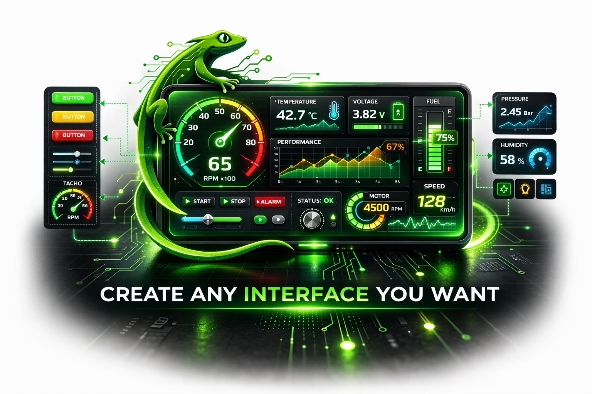
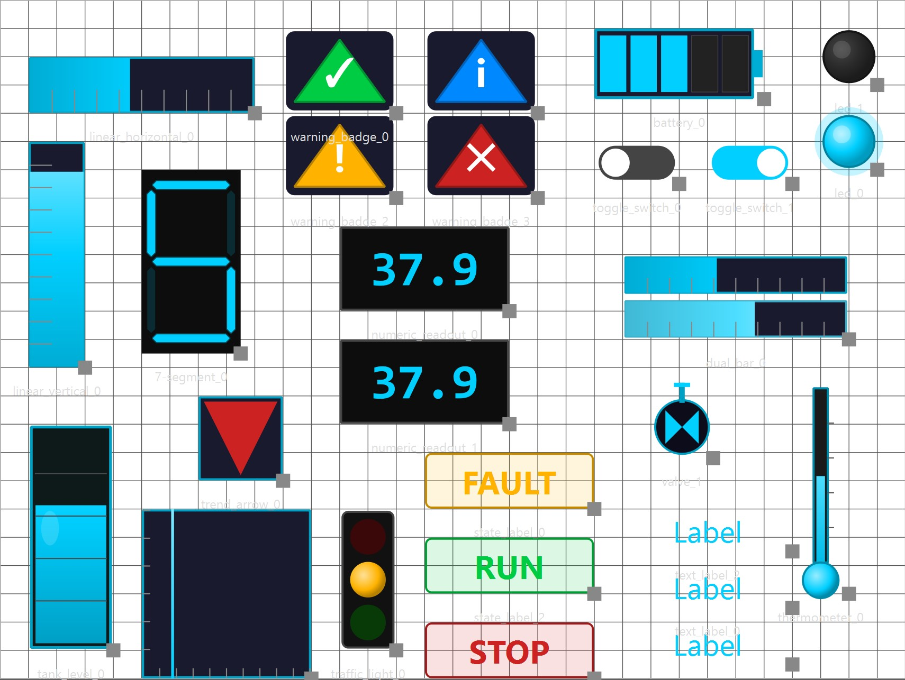

  

# Lacerta: Open Hardware Interface Engine for Embedded Systems

## Project Overview

**Lacerta** is an open-source hardware platform that enables the rapid creation of graphical interfaces for embedded systems using custom silicon.

The system allows developers to design graphical interfaces using a graphical configuration tool and deploy them directly to hardware implemented in a custom ASIC integrated with the Caravel SoC platform. The hardware renders the interface in real time and outputs the result through a VGA display.

The generated interface may include visual components such as:

- Buttons
- Horizontal and vertical bars
- Numeric indicators
- Status indicators

<b>Figure 1.</b> Examples of graphical components supported by Lacerta, including buttons, horizontal and vertical bars, numeric indicators, and status indicators used to visualize real-time system data.

The ASIC receives input data from sensors, external microcontrollers, or other embedded systems and dynamically updates the graphical elements according to the incoming data stream. Both analog and digital signals can be connected to the Lacerta platform through appropriate interface circuitry or external converters, enabling the visualization of a wide range of real-world signals. This allows physical measurements such as temperature, voltage, speed, or system status signals to be directly represented through graphical components including bars, indicators, and numeric displays.

<b>Figure 2.</b> Lacerta system concept: heterogeneous input signals are processed by the Lacerta ASIC to generate the custom graphical HMI displayed on a monitor.

The goal of Lacerta is to provide a low-cost, fully open-source reference architecture for embedded human–machine interfaces (HMI). By combining configurable hardware graphics generation with flexible input interfaces, Lacerta enables the rapid development of customizable dashboards and monitoring systems for industrial, commercial, and edge-IoT applications.
